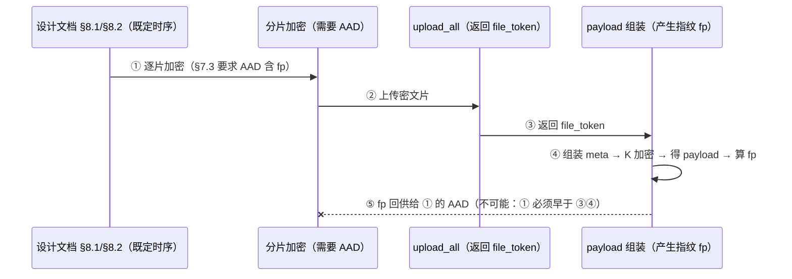

# 分片 AAD 协议偏差说明（评审输入）

| 项目 | 内容 |
|-|-|
| 文档名称 | 分片 AAD 协议偏差说明 |
| 版本 | v1.0（评审输入） |
| 状态 | 待项目负责评审；评审通过后据 §9 回贴飞书《文件传输功能设计文档》作为 v1.2 修订 |
| 日期 | 2026-09-17 |
| 作者 | 传输引擎实现（开发侧） |
| 评审对象 | 《文件传输功能设计文档》v1.1 §7.3 分片 AAD 规定（P2-1 落地条目） |
| 结论摘要 | §7.3 原规定**不可执行**（循环依赖）；实现改用 per-file 随机 `tid` 绑定，威胁模型下绑定强度等价；需以 D23 回写文档 |

本文是**评审输入**：只报告偏差、推导、等价性分析与修订文案，不改 `docs/`（飞书知识库只读同步镜像），不改任何代码。

---

## 1. 偏差一页纸

| # | 项 | 文档 v1.1 规定 | 实现（P0–P3 已落地） |
|-|-|-|-|
| 1 | 分片 AAD 绑定值 | `payload 指纹`（§7.3 AAD 行，第 281 行） | per-file 随机 `tid` |
| 2 | 分片 AAD 拼接 | `"QN2:v1" ‖ payload 指纹 ‖ n` | `"QN2:v1" ‖ tid(原始 16B) ‖ n(u32 小端)`，定长 26 字节 |
| 3 | 绑定值来源 | SHA-256(payload 原文字节)，即 §9.4 的 payload 指纹 | 每文件上传开始时 CSPRNG 生成 16 字节（`engine.rs:762`） |
| 4 | 绑定值载体 | 无需新增字段（从 payload 自身导出） | payload 信封新增顶层字段 `tid`（`Envelope`，`crypto.rs:105`） |
| 5 | payload 指纹的角色 | 分片 AAD + §9.4 单消费锁/缓存/`.part` 命名 | **仅** §9.4 单消费锁 / 已消费缓存 30 天 / `.part` 命名（定义不变） |
| 6 | payload 信封 AAD | `"QN2:v1"`（§7.3） | `"QN2:v1"`（`PROTO_AAD`，`crypto.rs:23`）——**未变** |

**偏差性质**：不是实现取舍或降级，而是 §7.3 该行与 §8.1/§8.2 上传时序存在**规格自相矛盾**；照 §7.3 执行在协议层面无解（§3）。

---

## 2. 背景：涉及的元素与既定语义

以下均引用 v1.1 原文语义，术语与 §3 术语表一致。

- **payload（§7.4）**= `base64url( nonce_env(12B) ‖ AES-GCM(K, "QN2:v1", JSON{dek,meta}) ‖ tag(16B) )`。群消息只发 `http://127.0.0.1:<bound_port>/dl?t=<payload>`。
- **信封 JSON（§7.2）**顶层 `v / kid / dek / meta`；`meta` 含 `name/mime/size/sha256/ts/chunks[]`；`chunks[i]` 含 `t`(云空间 file_token) / `n`(片序) / `off` / `size` / `nonce`。
- **DEK（§7.2）**= 每文件随机 256-bit，加密分片；经 K 加密后随 payload 传输。**每文件独立**是既定设计（D12/§7.1 第 3 条）。
- **kid（D19）**= SHA-256(K) 前 8 字节 hex；下载端据此选 current / previous K。
- **payload 指纹（§3 术语表、§9.4）**= SHA-256(payload 原文字节)；用途为单消费锁、幂等、已消费缓存（30 天）、`.part` 命名（§9.4 第 1/2 条）。
- **分片 AAD（§7.3 AAD 行）**= `"QN2:v1" ‖ payload 指纹 ‖ 片序号 n`；括号内目标："绑定所属传输与片序，防分片跨文件替换/错序"。
- **P2-1 的原始来源**：v1.0 评审意见 P2 第 1 条原话为"AES-GCM 建议带 AAD（如 `QN2` + 协议版本）防跨版本混淆；nonce 明确用 CSPRNG；payload 建议带版本字节以便演进"（见 `docs/文件传输功能设计文档-review.md:194`）。v1.1 落入 §7.3 时**扩展**为"绑定所属传输与片序"，并选定 payload 指纹作为绑定值。

---

## 3. 为什么 §7.3 原规定不可行（循环依赖推导）

### 3.1 四步代换

记 `chunk_cipher_i` = 第 i 片密文，`fp` = payload 指纹，`payload` = payload 字符串。

1. §7.3：`chunk_cipher_i = AES-GCM(DEK, nonce_i, plt_i, AAD_i)`，其中 `AAD_i` 含 `fp`。
   → 要产出 `chunk_cipher_i`，必须先有 `fp`。
2. §9.4 / §3：`fp = SHA-256(payload 原文字节)`。
   → 要产出 `fp`，必须先有完整 `payload`。
3. §7.2 / §7.4：`payload = K 加密(JSON{v, kid, dek, meta})`，而 `meta.chunks[i].t` = 云空间 `file_token`。
   → 要产出 `payload`，必须先有**全部分片**的 `file_token`。
4. §8.2 / §11：`file_token` 由 `POST /drive/v1/files/upload_all` 的**响应** `data.file_token` 返回。
   → 要产出 `file_token_i`，必须先完成第 i 片的上传，而上传的输入正是 `chunk_cipher_i`。

合起来：`chunk_cipher_i` ←需要— `fp` ←需要— `payload` ←需要— `file_token_i` ←需要— `chunk_cipher_i`。**闭环**，不存在可执行的拓扑序。

### 3.2 与 §8.1/§8.2 时序的对照

§8.1 流程图规定的顺序是：`计算 SHA-256 与 size → 生成 DEK → 切成 N 片 逐片加密 → 收集 file_token + nonce → 组装 metadata + ts → K 加密 payload → 发群`；§8.2 进一步固定单片时序为"加密后的 `ciphertext ‖ tag` 作为 `file:` 字段上传，响应取 `file_token`"。

也就是说，**加密（需要 AAD）→ 上传（产生 file_token）→ 组装 payload（产生指纹）** 是文档钦定的先后次序，而 §7.3 要求 AAD 依赖链条末端的产物。冲突点不在实现细节，而在 `§7.3 AAD 行` 与 `§8.1/§8.2` 两条规格之间：



### 3.3 为什么"退一步"也绕不开

- **`file_token` 不可预知**：官方在 `upload_all` 响应中返回（§11 接口清单、§8.2 时序），上传前无任何可用占位值；客户端不能自造（token 归平台命名）。
- **payload 是单一原子对象**：§7.4 定义 payload 承载完整 `meta`（含全部 `chunks[]`），不存在"先算一个不含 token 的部分 payload"的定义——只要指纹定义是"整个 payload 的 SHA-256"，就必须等全部 token 齐备。
- **非首片也救不了**：即便只对第 0 片做特殊处理（例如首片用别的 AAD），第 1 片起仍然需要 `fp`，环依旧成立。
- **`v1.1` 引入该条时未做联校**：P2-1 原话只要求"带 AAD 防跨版本混淆"（`docs/文件传输功能设计文档-review.md:194`），§7.3 落笔时把绑定值具体化为 payload 指纹，但未回头对照 §8.1/§8.2 的 token 产生时序——这是偏差的成因，也解释了"评审为何未发现"：冲突横跨 §7.3 与 §8.2 两节，单节内读均自洽。

### 3.4 附带发现：原规定还有编码歧义

即便忽略循环依赖，§7.3 的 AAD 行也**未规定** `payload 指纹` 在 AAD 中的字节编码：

- hex 文本 64 字节，还是 SHA-256 摘要的原始 32 字节？
- `n`（片序号）的整数编码（u32 小端 / 大端 / 文本）同样未规定。

两端若各按自己的理解实现，AAD 不同 → **片级解密必然失败**且难以定位。这条支持在 v1.2 中把 AAD 的字节布局写死（见 §9.3）。

---

## 4. 实现方案（与代码一致）

### 4.1 `tid` 的生成与生命周期

- 生成时机：`upload_inner` 读取第一片之前，与 DEK **同批** CSPRNG 生成（`engine.rs:759–762`：`let tid = crypto::random_bytes(16);`，`OsRng` 填充，见 `crypto.rs:73–77`）。
- 长度/熵：16 字节 = 128 bit CSPRNG，与 nonce/handle 同一随机源（D22 依赖基线中的 `rand` + getrandom）。
- 生命周期：一次上传尝试一个 `tid`，全程不变（同一传输所有分片共用）；payload 组装后 `tid` 随 payload 进入链接，仅存在于 payload 密文体内与本机内存，**不落盘、不写日志**（§10.2 日志纪律不变）。
- 不参与密钥派生：`tid` 只作为 AAD 输入，不影响 K/DEK 派生，也不影响非ce 生成——因此 `tid` 即使泄漏也不影响机密性。

### 4.2 编码位置

`tid` 是 **payload 信封的顶层字段**，与 `v / kid / dek / meta` 同级，**不在 `meta` 内**（`crypto.rs:98–107`：`Envelope { v, kid, dek, tid, meta }`）。编码为 `hex(16B)`，32 个十六进制字符（`engine.rs:811`；`crypto.rs:68–70` 的 `hex()` 小写）。

> 载体说明：本文档与 §9 修订文案统一按代码口径写作"payload 信封顶层字段"。口语里说的"hex 编码进 metadata"指的是"与 `kid/dek` 同级的载荷明文层"，与代码一致；`meta` 内**不**新增字段。

### 4.3 AAD 拼接

`crypto.rs:165–172`：

```rust
// 分片 AAD = `"QN2:v1" ‖ tid ‖ n(u32 LE)`（绑定传输与片序，防替换/错序）
fn chunk_aad(tid: &[u8], n: u32) -> Vec<u8> {
    let mut aad = Vec::with_capacity(PROTO_AAD.len() + tid.len() + 4);
    aad.extend_from_slice(PROTO_AAD);
    aad.extend_from_slice(tid);
    aad.extend_from_slice(&n.to_le_bytes())
}
```

字节布局（定长 26 字节）：

| 段 | 长度 | 内容 |
|-|-|-|
| 前缀 | 6 B | ASCII `QN2:v1`（`PROTO_AAD`，`crypto.rs:23`） |
| `tid` | 16 B | `tid` 的**原始字节**（由 payload 的 hex 字段解码），**不是** 32 字符 hex 文本 |
| `n` | 4 B | 片序号，u32 小端 |

定长 + 固定端序 ⇒ 无拼接歧义（不存在"`tid` 长度可变导致边界歧义"的空间）。

### 4.4 加密路径（上传端）

`engine.rs:769–790` 分片循环内：

```rust
let sealed = seal_chunk(&dek, &nonce, &tid, n, &chunk_plain)?;   // engine.rs:776
let token = client.upload_chunk(&month_dir, &cloud_name, sealed)...; // 响应 file_token
```

`seal_chunk`（`crypto.rs:175–178`）内部走 `chunk_aad(tid, n)` → `AES-256-GCM(DEK, nonce, AAD)`，输出 `ciphertext ‖ tag(16B)` 上传；`nonce` 以 base64url 存入 `chunks[i].nonce`（`engine.rs:785`），与 §7.3"云上仅存 `ciphertext ‖ tag`、nonce 存 metadata"一致。

### 4.5 校验路径（下载端）

1. `GET /dl?t=…` → `evaluate_payload`（`engine.rs:262–297`）：按 `kid` 选 current → previous K（§12.3），`open_payload` 用 AAD `"QN2:v1"` 解密并校验 tag（`crypto.rs:129–140`）→ 校验 `kid` 一致性 → `validate_metadata`（片数/off/size 连续覆盖、≤100 MB）→ `ts` 新鲜度 30 min。**此步无副作用**，同时按 §9.4 计算 payload 指纹。
2. `claim_session`（`engine.rs:341–381`）：per-指纹单消费锁 + handle 用后即焚（§10.1）。
3. `run_download_sync`（`engine.rs:387–543`）：
   - 解 DEK（base64url → 32 B，`engine.rs:398–403`）；
   - **解码 tid**：`let tid = hex_decode_16(&env.tid)?;`（`engine.rs:404`；`hex_decode_16` 强制 32 字符 hex → 16 字节，`engine.rs:729–737`，长度非法即报"tid 长度不合法"）；
   - 逐片：下载 → 解 nonce → `open_chunk(&dek, &nonce, &tid, chunk.n, &sealed)`（`engine.rs:468`）→ 明文长度校验 → 按 `off` 写入 `.part`；
   - 全片完成 → `sync_all` → 全文件 SHA-256 与 `meta.sha256` 比对（`engine.rs:489–497`）→ 原子 rename + 重名加时间戳 → 下载即删（D11）。
   - 失败：清 `.part` 或保留侧车供断点续传（§9.4/U13）。

### 4.6 payload 指纹的角色（未变）

- 定义：`SHA-256(payload base64url 原文字节)`（`crypto.rs:143–145`，实现为对 `t=` 取值字符串的字节做 SHA-256；base64url 无填充、字符集全为 URL 安全字符，故不存在百分号编码导致的字形漂移）。
- 用途（与 §9.4 逐条对应）：
  - 单消费锁 / 幂等：`fp_state` 与已消费缓存（`engine.rs:355–370`、`565–582`、`local_server.rs:244–247`）；
  - 已消费缓存 30 天（`engine.rs:570`）；
  - `.part` 命名：`{safe_name}.{指纹前 8 hex 字符}.part` + 同名 `.json` 侧车（`engine.rs:412–414`）。
- **`payload 指纹` 不再出现在任何 AAD 中**。

### 4.7 测试覆盖

`crypto.rs:372–388` `chunk_roundtrip_and_aad_binding`：

| 断言 | 验证内容 |
|-|-|
| `open_chunk(dek, nonce, tid, 0, sealed) == plain` | 正常往返 |
| `open_chunk(dek, nonce, tid, 1, sealed)` 报错 | **换片序** → AAD 不匹配 → 拒绝 |
| `open_chunk(dek, nonce, tid2, 0, sealed)` 报错 | **换 tid**（等价于跨传输替换）→ 拒绝 |
| `open_chunk(dek, nonce, tid, 0, tampered)` 报错 | 密文篡改 → GCM tag 拒绝 |

即 §7.3 括号声明的两个目标（防替换、防错序）均有片级回归测试。项目当前 `cargo test` 32 个单测全绿（含本条）。

---

## 5. 安全性等价性分析

### 5.1 对照 §12.1 威胁模型

| §12.1 攻击者 | 攻击方式 | 原方案（payload 指纹 AAD）的防御 | 现方案（tid AAD）的防御 | 差异 |
|-|-|-|-|-|
| 项目组其他成员（持同一应用凭据） | 枚举/下载全部密文分片 | 无 K/DEK 不可解密 | 同左（DEK 每文件随机，与 `tid` 无关） | **无** |
| 任意群成员 | 伪造链接 / payload 诱导 | payload GCM tag + 字段自洽失败即拒 | 同左（`tid` 完整性与机密性由 payload 的 K-AEAD 承担） | **无** |
| 中间人（篡改） | 改 payload 或密文分片 | payload tag 拒；分片 tag + AAD 拒 | 同左：改分片密文 → tag 拒；换片 → AAD `n` 拒；换成别的传输的片 → AAD `tid` 拒（且 DEK 不同，双重拒） | **无** |
| 重放者 | 重放旧 payload | ts（D8）+ 下载即删（D11）+ 已消费指纹缓存 | 同左（payload 指纹用途未变） | **无** |
| 飞书平台侧 | 读取云上密文 | 无 K/DEK | 同左 | **无** |
| 本机攻击者 | 跨站 POST / 读链接 | Origin + handle + GET 无副作用；本机被攻破不在保护范围（P2-4） | 同左（`tid` 不新增本机可见面：仅存在于 payload 与内存） | **无** |

### 5.2 逐项绑定强度对照（对照 §7.3 括号声明的两个目标）

| 目标 | 攻击构造 | 原方案 | 现方案 | 是否等价 |
|-|-|-|-|-|
| 防错序 | 同传输内交换第 i、j 片密文 | `n` 不符 → AAD 不匹配 → 拒 | 同左（`n` 仍在 AAD，编码固定 u32 小端） | 等价 |
| 防替换（同传输内） | 用第 j 片密文冒充第 i 片 | 同上 | 同上 | 等价 |
| 防替换（跨传输） | 把传输 A 的片塞进传输 B 的 payload | `fp_A ≠ fp_B` → 拒 | `tid_A ≠ tid_B` → 拒（**另有** `DEK_A ≠ DEK_B` → 解密失败） | 等价（唯一性均为每传输一个 128 bit+ 随机/派生唯一值） |
| 防跨版本混淆 | 用 v2 的片冒充 v1 | 前缀 `"QN2:v1"` → 拒 | 同左（前缀未变） | 等价 |
| 防裁剪/缺失 | 删除第 i 片 | **不由 AAD 承担** | 同左 | 等价（见下） |

**裁剪/缺失的职责澄清（两方案一致）**：AAD 无法检测"少了一片"。该防护由两条既有机制承担，与 AAD 选值无关：

1. §7.5 第 3 步 / `validate_metadata`（`crypto.rs:264–306`）：片数必须等于 `ceil(size/CHUNK_SIZE)`、`off` 必须连续覆盖 `[0, size)`、末片大小必须精确 → 缺片/重片在**解密前**即被拒；
2. §7.5 第 6 步：合并后 SHA-256 与 `meta.sha256` 比对 → 内容级兜底。

### 5.3 AAD 的真实增量（为何不能干脆去掉 AAD）

即使没有 AAD，多数篡改也会被后面的 SHA-256 拦下，但存在**片内容相同**的退化工况：

- 文件由重复块构成（全零段、重复填充、同一 16 MB 模板重复多次）时，同传输内交换两片密文，解密后字节序列**完全不变** → 最终 SHA-256 依然匹配 → 无 AAD 则错序不可检出、也无从告警；
- 带 AAD 时在**片级、解密当时**即失败，无需下载完整文件。

因此 AAD 的价值是"片级早失败 + 覆盖内容同构工况"；`"QN2:v1" ‖ tid ‖ n` 完整保留了这部分价值（`n` 是其中起主作用的字段）。

### 5.4 残余差异（诚实清单）

| # | 差异 | 分析 | 结论 |
|-|-|-|-|
| D-1 | 绑定对象由「精确的那一份 payload」降为「传输身份」 | 原方案下，分片密文与"具体 payload 字节（含 token 列表、`ts`、`sha256`、各 `nonce`）"一一对应；现方案只绑到传输，分片密文本身**不再证明**"我被哪一份 payload 引用"。该"引用关系"的认证改由 payload 的 K-AEAD 承担：token 列表位于 K 加密体内并被 payload GCM tag 覆盖，无 K 者无法改动 payload（改一字节即 tag 失败）。有 K 者本就在 §12.2 的机密性边界内 | **§12.1 全部攻击者类别下无观测差异**；但依赖"payload 仅由持 K 端生成/消费"这一架构前提（见 R2） |
| D-2 | `tid` 不能由无 K 方推导（payload 指纹可以） | AAD 在 GCM 中是**公开输入而非密钥**：既不要求保密，也不要求公开可验证。故"无 K 方算不出 `tid`"不构成安全削弱；唯一副作用是无 K 方（含云平台）无法做"分片↔传输"归属校验——而它们本来也无法解密，无功能损失。反向看，`tid` 减少了信息暴露面：payload 指纹对无 K 方可见（可对同一 payload 的重放做关联），`tid` 不可见 | 无削弱（净收益为正） |
| D-3 | 唯一性来源不同 | payload 指纹的唯一性来自 payload 字节不可预测（内含随机 `nonce_env` 与随机 DEK）；`tid` 的唯一性来自 128 bit CSPRNG。二者重复概率均 < 2⁻¹²⁸ 量级 | 等价 |
| D-4 | 原规格未定义 AAD 字节编码（§3.4），现方案已固定为定长 26 B | 现方案把"前缀 6 B ‖ `tid` 原始 16 B ‖ `n` u32 小端"写死，消除 hex/原始字节、大小端两类歧义 | 现方案**严格更明确** |

### 5.5 关于"AAD 里带 `tid` 会不会因为它在 payload 明文中而削弱安全性"

不削弱。要点三点：

1. **位置**：`tid` 是 payload 信封的顶层字段（`crypto.rs:105`），随 payload 整体进入 `AES-256-GCM(K, "QN2:v1", …)`。payload 的 GCM tag 覆盖**整个 JSON 明文**（AAD 只是额外绑定 `"QN2:v1"`），因此 `tid` 的**机密性 + 完整性**都由 K 保证——`tid` 不是"明文可见"的：对 §12.1 前五类无 K 攻击者不可读、不可改。
2. **可见者已在边界内**：能读出 `tid` 的只有持 K 的两台机器（§12.2：K 是唯一机密性边界）。持 K 者不需要 `tid` 也能解密全部内容，读不读到 `tid` 不改变其能力。
3. **AAD 无需保密**：即便未来某形态下 `tid` 变成公开值，GCM 的安全性质也不依赖 AAD 的保密性（AAD 只参与认证，不参与密钥派生）。`tid` 亦不参与 K/DEK/nonce 派生，泄漏不导致解密能力。

---

## 6. 为什么不选其他方案

| 方案 | 可行性 | 成本 | 放弃理由 |
|-|-|-|-|
| **A 严格按 §7.3（payload 指纹做 AAD）** | **不可行** | — | 循环依赖（§3）；不存在满足 §7.3 与 §8.2 的执行序 |
| **B 先上传再回填重加密**（先用临时 AAD 上传 → 待 payload 齐备算出指纹 → 逐片下载、重加密、重传、删旧片） | 可行 | 每片 Drive 调用 3 → **5**（上传+下载+重传+接收端下载+删除）；100 MB / 7 片：21 → **35** 次 | ① 破坏 §7.1 第 3 条与 D17 的"逐片独立加密上传 / 断点续传"语义（重加密需全片齐备）；② §6.5 额度模型失效：按 10,000 次/月、含固定开销与 10% 重试余量，全 100 MB 场景由约 430 个/月降至约 280 个/月；③ 上传窗口内云端存在"用错 AAD 的密文"，失败即产生额外孤儿；④ 收益为 0：重加密后 AAD 与 `tid` 方案提供**相同**的绑定强度（§5.2） |
| **C AAD 用文件 `sha256` ‖ n** | 可行（`sha256` 可在加密前预计算，无环） | 需把全文件 SHA-256 提前到切片加密之前（现实现是片循环之后，`engine.rs:793–794`），大文件多一次全量读 | 语义不符：`sha256` 是**内容标识**，同一文件重复传输时 AAD 完全相同，无法满足 §7.3 括号要求的"绑定**所属传输**"；跨传输替换的防护实际仍靠随机 DEK，因此对威胁模型的增益与 `tid` 相同，但语义更弱、成本更高（额外全量 IO） |
| **D AAD = `tid` ‖ `sha256` ‖ n** | 可行 | 同 C 的预哈希成本 | 冗余：`sha256` 维度已在 payload K-AEAD 覆盖内（§5.4 D-1），不增加任何"防替换/错序"能力；仅在未来需要把 AAD 与"内容身份"挂钩时才有意义（列为可选加固，见 §10 Q3） |
| **E 把 `file_token` 移出 payload**（payload 只带 `tid`，token 列表改走云上索引文件/命名约定） | 可行但劣 | 每文件增加 1 次上传 + 1 次下载 + 1 次删除（索引对象） | ① 索引对象本身可被持凭据成员枚举（C4），等于把 token 列表的保护从 K 挪到"云侧不可推测"上，削弱 §7.1 第 1 条"机密性只依赖端侧密钥"；② 破坏 §7.2"payload 是唯一传播内容"的简洁性；③ 引入新的失败态（索引与分片不一致） |
| **F 改用飞书分片上传 API，拿 `upload_id` 做 AAD** | 可行（`upload_prepare` 先于分片上传返回事务标识，可破环） | 事务 24 h、接口更多 | ① §11 已定案**不使用**飞书分片 API（20 MB 硬顶使其无收益；D10 背景）；② 把 AAD 绑定值外包给平台的内部事务标识，且该值不表达"传输身份"；③ 增加调用次数与状态机复杂度，与 §6.5 额度模型冲突 |
| **G 不做 AAD 绑定（仅 `"QN2:v1"`）** | 可行 | 0 | 内容同构工况下错序不可检出（§5.3），且直接放弃 P2-1 的加固意图 |
| **✅ 采纳：`tid`（16 B CSPRNG）进 AAD** | 可行（已落地并有单测） | 0（AAD 定长 26 B；payload 增 1 个字段 ≈ 32 字符 hex，远低于 §7.4 的 20 KB 预算） | 绑定强度与方案 A 在威胁模型下等价（§5.2），无额外 IO、无额外 API 调用，时序与 §8.1/§8.2 完全相容 |

---

## 7. 残余风险清单

| # | 风险 | 现状 | 影响 | 建议处置 |
|-|-|-|-|-|
| R1 | **上传重试/断点续传若更换 `tid`**：已上传分片的 AAD 与新 `tid` 不再匹配，这些片永久不可解密，成为孤儿 | 现实现每次上传尝试生成一个 `tid`（`engine.rs:762`），尚无上传侧续传 | 协议级不变量被破坏（"一个传输一个 `tid`"），表现为下载端片级解密失败 | 把"同一传输（含重试/续传）必须复用同一 `tid`"写入 §7.3/§8.2 作为实现纪律；未来做上传续传时须持久化 `tid` |
| R2 | **依赖"payload 只能由持 K 端生成/消费"**：D-1 的等价性依赖该前提 | 当前架构成立（payload 由发送端本机组装、接收端本机解密） | 若未来引入无 K 中继（服务端代发链接、云端索引重排 payload、第三方"链接美化"服务），token 列表的完整性不再有 K-AEAD 兜底，D-1 可能升级为真实缺口 | 在 §7.3 加一句架构前提声明；一旦引入此类形态，必须回到 AAD 能否绑定 payload 字节的评审 |
| R3 | **AAD 编码漂移**：文档若只写"`tid`"不写编码，后续实现可能用 hex 字符串而非原始 16 字节、或用大端 `n` | 现实现固定（`crypto.rs:166–172`；`hex_decode_16` 强制 32 字符） | 两端实现分歧 → 片级解密失败，且 AAD 不匹配的报错与"密钥不匹配"易混，排障成本高 | 修订文案中写死字节布局与端序（§9.3）；验收用例 U19 覆盖（§9.7） |
| R4 | **`n` 为 u32**：超过 2³²−1 片会溢出 | D18 上限 100 MB / 16 MB = 最多 7 片，物理不可能触及 | 无 | 文档注明 `n` 为 u32 小端即可 |
| R5 | **payload 指纹的规范化脆弱性（既有，非本次偏差引入）**：指纹是对 payload 字符串**字节**做哈希，链接若被客户端改写（补齐 `=` 填充、百分号编码、大小写归一）会得到不同指纹 → 幂等/已消费缓存失效（重复下载） | base64url 无填充、字符集 `A-Za-z0-9-_` 全为 URL 安全字符，正常链路不会有字形变化 | 仅影响幂等命中率，不产生安全缺口（不会绕过 ts、单消费锁之外的防护；重复下载仍受 payload tag 与 D11 约束） | 保持现状；若未来出现新链接消费端（如 App 内分享），需在 §9.4 加"指纹计算前先做 base64url 规范化"的一条 |
| R6 | **Doc-Impl 漂移（本次最高优先级）**：文档仍写着不可执行的 §7.3 | 未回写 `docs/`（只读镜像，须回贴飞书真源） | 后续开发者按 §7.3 实现会产生与现有实现不可互操作的分片，且会先撞上循环依赖而停工 | 评审通过后立即按 §9 回贴 v1.2；在此之前以本文档为实现侧权威口径 |
| R7 | **开发期存量兼容**：若存在按旧 AAD（payload 指纹）生成的历史 payload/云端分片 | 待确认（见 §10 Q5）：实现从落地起即用 `tid`，`envelope.tid` 缺失的 payload 会在 `hex_decode_16` 处失败 | 历史测试链接失效 | Q5 确认无存量则无需兼容层；若确认有，则旧 payload 作废并提示重新上传 |
| R8 | **报错可区分性**：`tid` 长度/hex 非法 → "tid 长度不合法/非法 hex"，与"片解密失败"分列 | `engine.rs:729–737`、`crypto.rs:182–184` | 无安全影响；排障友好 | 无需处置 |

**未新增的风险面（逐条确认）**：不新增 API 调用（§6.5 额度模型不变）；不新增落盘/日志（`tid` 仅内存与 payload 密文体）；不改变 payload 大小预算（§7.4，新增 32 字符）；不改变 payload 信封 AAD（仍 `"QN2:v1"`）。

---

## 8. 附带发现（非本次偏差，供一并裁定）

核验过程中另发现两处"文档—实现"小差异，均**与分片 AAD 无关**，一并列出以免下一轮评审重复提出：

| # | 文档 | 实现 | 影响 |
|-|-|-|-|
| N-1 | §9.4：`.part` 命名 `<name>.<指纹前 8 字节>.part`（= 16 hex 字符） | `fp8 = &pending.fingerprint[..8]`（= 8 hex 字符 = 指纹前 **4** 字节，`engine.rs:412–413`、`548`） | 隔离命名空间由 64 bit 降为 32 bit；同名文件 + 同目录下不同 payload 的前 8 hex 字符碰撞概率极小，且侧车有 `size` + `sha256` 过滤（`engine.rs:424–433`），不会误续传。属**文档措辞与实现口径不一致**，建议择一修正 |
| N-2 | §7.5 第 4 步：`now - ts ≤ 30 min`（单向，只拒过期） | `is_fresh` 用 `(now - ts).abs() <= 1800`（双向，`crypto.rs:313–315`） | 实现比文档**宽松**：允许最多 30 min 的未来 `ts`。payload 的 `ts` 被 K-AEAD 认证、攻击者不可改；实际影响是本机时钟偏快的发送端可让链接多存活至多 30 min。§12.3"时钟"条目已声明 ±30 min 偏差口径，与该实现一致而与 §7.5 措辞不一致 |

---

## 9. v1.2 修订文案（可直接回贴飞书文档）

> 用法：以下片段以引用块标出应替换/新增的位置与全文。**本仓库 `docs/` 为飞书知识库只读镜像，不得就地修改**——请编辑飞书真源文档，再经 `scripts/` 同步回 `docs/`。

### 9.1 §2 方案变更记录：新增一行（表格末行）

```markdown
| **v1.2** | **分片 AAD 修订：绑定值由 payload 指纹改为 per-file 随机 `tid`（新增 D23）；§7.2 信封增 `tid` 字段、§7.3 AAD 行重写并写死字节布局、§7.5 校验补 `tid` 解码步骤、§16 增 U19** | P2-1 落地时发现 §7.3「分片 AAD = `"QN2:v1"` ‖ payload 指纹 ‖ n」与 §8.1/§8.2 上传时序构成**循环依赖**：payload 含各片上传后才由平台返回的 `file_token`，而分片加密须早于上传，规格无法执行；改用每文件 16 字节 CSPRNG `tid`，绑定强度在 §12.1 威胁模型下与 payload 指纹等价（详见《分片 AAD 协议偏差说明》） |
```

同时修订首部表格：`| 版本 | **v1.2（分片 AAD 修订版）** |`、`| 状态 | v1.1 复审待办项 D23 收口；分片 AAD 已按 v1.2 落地（待回写确认） |`、`| 日期 | 2026-09-17（v1.2 修订）；2026-09-16（v1.1 修订） |`。

### 9.2 §3 术语表：新增 `tid` 条目（建议置于 `kid` 行之后）

```markdown
| tid | 传输 ID：每文件（每次上传尝试）随机生成的 16 字节 CSPRNG 值，编码为 32 字符 hex 存于 payload 信封顶层（与 `kid`/`dek` 同级，不在 `meta` 内）；用于分片 AAD 绑定所属传输（D23，§7.3）；不参与 K/DEK/nonce 派生 |
```

### 9.3 §7.2 信封结构（payload 明文）：JSON 示例补 `tid`

替换 `"dek"` 行与其下一行的位置，插入 `tid` 字段（保持注释风格一致）：

```markdown
  "dek": "<base64url(DEK)，解码后 32 字节>",  // 数据密钥（payload 整体已由 K 加密；密钥编码见 §12.3）
  "tid": "<hex(16B)，32 字符>",              // 传输 ID：每文件 CSPRNG 生成，绑定分片 AAD（D23，§7.3）；与 DEK 同批生成、同生命周期
```

### 9.4 §7.3「AAD」行：整行替换

```markdown
| AAD | 分片：`"QN2:v1" ‖ tid ‖ 片序号 n`（`tid` 取**原始 16 字节**（由 payload 信封的 hex 字段解码），非 hex 文本；`n` 为 **u32 小端** 4 字节；AAD 定长 26 字节，绑定所属传输与片序，防分片跨文件替换/错序，P2-1/D23）；payload 信封：`"QN2:v1"` |
```

### 9.5 §7.3：在表格后补一段实现纪律（新增行外说明）

```markdown
> **`tid` 生成与不变式（D23）**：`tid` 在读取第一个分片之前与 DEK 同批 CSPRNG 生成，写入 payload 信封；**同一传输的全部重试与断点续传必须复用同一 `tid`**——更换 `tid` 会使已上传分片因 AAD 不匹配而永久不可解密（成为孤儿，由 §6.4 定期清理回收）。分片 AAD 不再引用 payload 指纹；payload 指纹的定义（= SHA-256(payload base64url 原文字节)）与用途（单消费锁 / 已消费缓存 / `.part` 命名，§9.4）**保持不变**。
```

### 9.6 §7.5 校验逻辑（下载端）：替换第 5 步

```markdown
5. 解码 `env.tid`（32 字符 hex → 16 字节；长度或字形非法即拒绝）→ 逐片下载 → 逐片解密（AAD = `"QN2:v1" ‖ tid ‖ n`，GCM tag 校验）→ 按 off 写入 `.part`
```

### 9.7 §12.1 威胁模型：「中间人（篡改）」行的防御列补 AAD 口径

```markdown
| 中间人（篡改） | 可改消息内容 | 篡改 payload 或密文分片 | GCM tag 认证失败即拒绝；分片 AAD（`"QN2:v1" ‖ tid ‖ n`）使换片/错序/跨传输替换在片级即被拒绝（D23） |
```

### 9.8 §15 决策记录：新增 D23（表格末行）

```markdown
| D23 | 分片 AAD 绑定值 | **per-file 随机 `tid`**（16 字节 CSPRNG，hex 存于 payload 信封顶层；分片 AAD = `"QN2:v1" ‖ tid(原始 16B) ‖ n(u32 小端)`，定长 26 字节）；`payload 指纹`（§9.4）定义与用途不变。理由：§7.3 原定的 payload 指纹与 §8.1/§8.2 上传时序循环依赖，不可执行（§7.3） |
```

### 9.9 §16 验收与测试：新增 U19（表格末行）

```markdown
| U19 | **分片 AAD 绑定（D23）** | 交换同传输两片密文 → 片级解密失败；用另一传输的分片替换 → 片级解密失败；篡改分片密文 → 片级解密失败；删除某片 → 元数据自洽校验拒绝（§7.5 第 3 步）或合并后 SHA-256 不匹配；`tid` 改一位 hex → 片级解密失败 |
```

---

## 10. 待项目负责确认的决策点

| # | 决策点 | 开发侧建议 | 备注 |
|-|-|-|-|
| Q1 | **是否采纳 `tid` 替代 payload 指纹进分片 AAD（即 D23）** | 采纳。严格按 §7.3 无解（§3）；其他可行方案均更贵或更弱（§6） | 若否决，需要项目负责给出一个可执行的替代时序，否则分片 AAD 该条款须整体撤回 |
| Q2 | **是否需要在 payload 之外"回填指纹"做二次校验**（例如链接追加 `&fp=<SHA-256(payload)>`，下载端计算并比对） | 不建议。指纹不能写进 payload 自身（自指不可行）；作为链接旁路参数时，其能检出的"链接字串损坏"已被 base64url 解码失败与 payload GCM tag 覆盖，无净收益，只增加一个可被篡改的旁路字段 | 若确需"链接完整性自校验"（如未来经第三方分享），再单独评审 |
| Q3 | **是否把 `meta.sha256` 追加进分片 AAD**（`"QN2:v1" ‖ tid ‖ sha256 ‖ n`，内容身份绑定） | 暂不需要（§5.4 D-1、§6 方案 D）。若采纳，需同时修订 §8.1 时序：全文件 SHA-256 必须提前到切片加密之前（当前实现在片循环之后） | 收益仅限"内容身份"维度，与"防替换/错序"无关 |
| Q4 | **上传重试/断点续传的 `tid` 复用纪律是否写入文档**（R1） | 建议写入（§9.5 已拟文案） | 属未来上传续传（P4 范围）的前置约束，现在写成本最低 |
| Q5 | **是否存在按旧 AAD（payload 指纹）生成的历史 payload / 云端分片存量**（R7） | 需确认。若无存量，直接切换、无需兼容层；若有，声明旧链接作废 | 影响是否需要在 `open_payload` 层加"缺 `tid` 字段"的显式错误提示 |
| Q6 | **`§9.4 .part 命名（N-1）与 §7.5 ts 单向窗口（N-2）两处小差异是否一并修订** | 建议一并纳入 v1.2：N-1 择一改口径（改文档或改实现，二者均无安全影响）；N-2 建议把 §7.5 措辞改为"`abs(now - ts) ≤ 30 min`"（即双向窗口）以与 §12.3 时钟口径、实现一致 | 两处均非本次偏差，放行与否不影响 D23 |
| Q7 | **P4 二批 / U15 spike 的评审是否与本次合并** | 由项目负责决定。本偏差已在 P0–P3 落地并有单测覆盖，单独收口可先解除文档阻塞（R6） | 见记忆中的"P4 二批与 U15 spike 遗留" |

---

## 11. 证据索引（可查证）

文档（v1.1，只读镜像）：

- §3 术语表 payload 指纹定义 — `docs/文件传输功能设计文档.md:99`
- §7.2 信封结构 JSON、`kid`/`dek`/`chunks[i].t` — `docs/文件传输功能设计文档.md:251–270`
- §7.3 AAD 行（本次偏差对象）— `docs/文件传输功能设计文档.md:281`
- §7.4 payload 定义与预算 — `docs/文件传输功能设计文档.md:285–286`
- §7.5 下载端校验 1–7 步 — `docs/文件传输功能设计文档.md:290–296`
- §8.1 上传流程（加密先于 token 收集）— `docs/文件传输功能设计文档.md:304–318`
- §8.2 upload_all 与 `data.file_token` — `docs/文件传输功能设计文档.md:320–333`
- §9.4 payload 指纹用途（单消费锁 / 缓存 / `.part` 命名）— `docs/文件传输功能设计文档.md:376–383`
- §11 `upload_all` / `download` 接口清单 — `docs/文件传输功能设计文档.md:431–432`
- §12.1 威胁模型表 — `docs/文件传输功能设计文档.md:461–468`；§12.2 安全结论 — `470–474`；§12.3 时钟口径 — `488`
- §16 U15/U18 — `docs/文件传输功能设计文档.md:583、586`
- P2-1 原始评审意见 — `docs/文件传输功能设计文档-review.md:194`

代码（P0–P3 已落地）：

- 模块头偏差说明 — `src-tauri/src/transfer/crypto.rs:4–12`
- `PROTO_AAD` / `PROTO_VERSION` / `CHUNK_SIZE` / `MAX_FILE_SIZE` — `crypto.rs:23–33`
- `Envelope.tid`（顶层字段）— `crypto.rs:98–107`
- `payload_fingerprint` — `crypto.rs:143–145`
- `select_key`（kid → current/previous）— `crypto.rs:149–161`
- `chunk_aad` / `seal_chunk` / `open_chunk` — `crypto.rs:165–184`
- `validate_metadata` — `crypto.rs:264–306`
- `is_fresh`（双向窗口）— `crypto.rs:313–315`
- 单测 `chunk_roundtrip_and_aad_binding` — `crypto.rs:372–388`
- `tid` 生成（与 DEK 同批）— `engine.rs:759–762`
- `seal_chunk(… tid, n …)` 调用 — `engine.rs:776`
- payload 信封组装（`tid: crypto::hex(&tid)`）— `engine.rs:807–814`
- `evaluate_payload`（选 K → 解密 → 元数据 → ts → 指纹）— `engine.rs:262–297`
- `claim_session`（单消费锁 + handle 焚毁）— `engine.rs:341–381`
- `hex_decode_16(&env.tid)` — `engine.rs:404`、`729–737`
- `open_chunk(dek, nonce, tid, chunk.n, sealed)` — `engine.rs:468`
- `.part` / 侧车命名（`fp8`）— `engine.rs:412–414`、`548`
- 已消费缓存 30 天 — `engine.rs:555–582`
- 已消费命中（确认页） — `src-tauri/src/local_server.rs:244–247`

---

## 12. 交付声明

- 本次仅新增本文件：`dev-notes/分片AAD协议偏差说明.md`（`dev-notes/` 目录为本次新建）。
- **未修改** `docs/`（飞书知识库只读同步镜像，本地改动不等于改真源）、未修改任何 Rust / JS / 配置 / 脚本文件。
- §9 的修订文案仅供回贴飞书真源文档使用。
